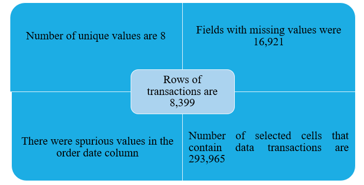

## Overview
- Superstores is a mega store that specializes in the sales and supply of furniture, office supplies and information technology equipment and gadgets. 
- Superstores customers range from corporate firms, individual customers to small businesses and home offices. It has sales outlets in nine regions of Nunavut, North West Territories, Atlantic, Prairie, West Ontario, Quebec and Yukon.
- Superstores sales are through two channels which are online and reseller (walk-in-customers).

## Problem Statement
- Which product category, region, Province and Customer Segment is most profitable? 
- What is the Minimum, Maximum, Median, Mode and Mean (average) days to ship an order from the order date to ship date? 
- How many Critical (Order) priority orders took longer to ship than the mean (average) days to ship?
- Which region/manager is the worst offender based on this key performance indicator? 
- Plot the chart of revenue based on the day of the week. Which weekday do we perform well the most? 
- Which Ship mode cost the most and by how much? What is the average shipping cost across all sales transactions?

## Skills/Competencies/Concepts Demonstrated;
- Business understanding
- Getting data into Microsoft Excel
- Data Exploration and Understanding
- Data Preparation - making data robust and fit for purpose
- Data Cleansing - Removing all spurious and unclean values
- Input missing values
- Data formats
- Deriving new variables
- VLookUp
- Pivot Tables
- Advanced Excel Functions
- Measures of Central Tendencies 
- MIR, Dashboard development, KPI generation
- Recommendation and Presentation

Insights                                         |      Insights2
:-----------------------------------------------:|:----------------------------------------------:
                                |      

    

 

Profit by Region                                 |      Profit by Customer Segment
:-----------------------------------------------:|:----------------------------------------------:
                          |       

Profit by Product Category                       |      Profit by Year and Month
:-----------------------------------------------:|:----------------------------------------------:
                 |       

Days to Ship                                     |      Shipping Cost Comparison
:-----------------------------------------------:|:----------------------------------------------:
                              |       

Returned Items by Regional Managers              |      Returned Items by Category
:-----------------------------------------------:|:----------------------------------------------:
         |       

## Thank you.

**_Disclaimer_**:_Datasets and visualizations do not represent any company or region but a dummy dataset used to demonstrate capacity.

